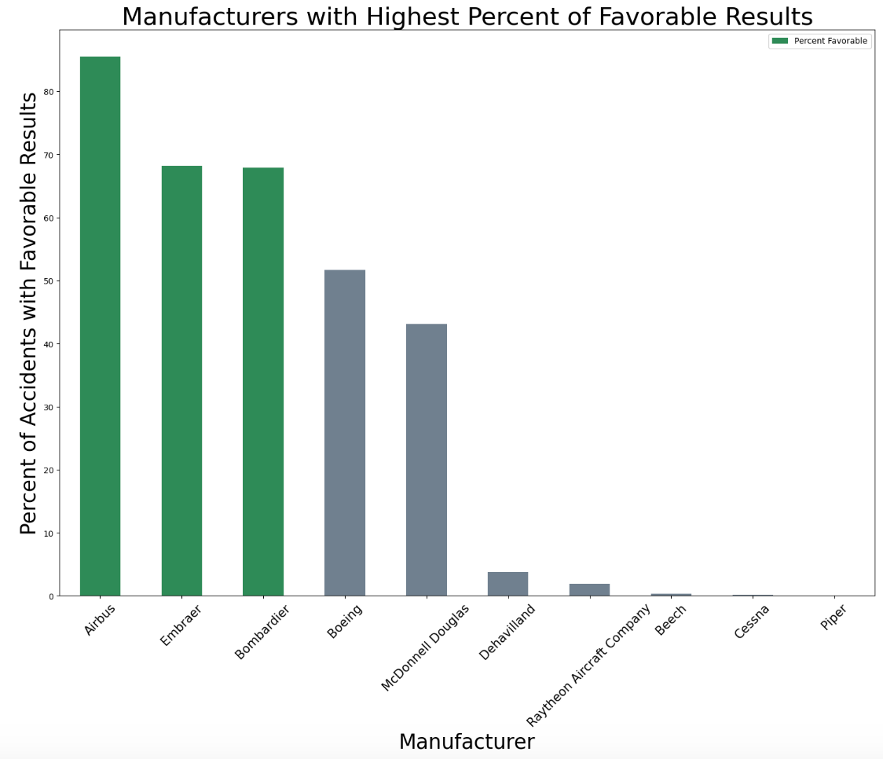

# Aircraft EDA Phase 1 Project - Midwest Jet Expansion Proposal
Authors: [Emily Krueger](https://github.com/ekrueger1217) & [Katya Serbina](https://github.com/serbinaekaterinai)

## Overview
Midwest Jet is a regional commercial airline that operats in the Midwest region of the United States (US). After years of continued growth and success in the Midwest, Midwest Jet is exploring the opportunity to expand operations geographically to additional US markets. In doing so, passenger safety is top of mind and will drive decision making throughout the process. 

## Business Understanding
Using data from the National Transportation Safety Board that includes global aircraft accident and incident records from 1962 to 2023, we'll be addressng the following: 

1. What is the best market to enter next?
2. Which aircrafts are best to acquire to expand Midwest Jet's existing fleet to accomodate increased operations?
3. When should Midwest Jet aim to launch this new venture?

Reccomedations will be provided to leadership at Midwest Jet to assist in the planning and execution of the company's expansion.

## Data Understanding and Analysis

### Data Overview
We are using aviation accident data from the National Transportation Safety Board that can be found [here](https://www.kaggle.com/datasets/khsamaha/aviation-accident-database-synopses). This dataset includes global accidents and incidents occcuring between 1962 and 2023 and involving various types of aircrafts. The dataset additionally includes information on the severity, location, and conditions of each record.

To address Midwest Jet's specific needs, we reduced our dataset by observing US only accidents that have occurred over the last 20 years. We also eliminated any records that did not have information on passenger injuries and fatalities, as we believe the severity of accidents is crucial in assessing safety. 

### Analysis and Business Reccomendations
1. We propose that Midwest Jet extend their operations to the East Coast of the US.
    * States along the East Coast boast some of the lowest fatality rates in the country
    * Of the top 15 states with the lowest fatality rates, 11 are on the East Coast.

2. We reccommend that Midwest Jet consider purchasing Airbus and/or Boeing aircrafts to safely build upon their existing fleet.
    * We defined a ”favorable” result of accident defined as zero fatalities and less than ten individuals injured and an “unfavorable” result of accident defined as at least one fatality and aircraft categorized as destroyed
    * On an absolute basis Boeing and Airbus have reported high numbers of non-fatal, low injury crashes in comparison to peers

   * In relation to total accidents reported, Airbus has reported a very high percentage of non-fatal, low injury accidents
   * In addition, Boeing should not be eliminated from consideration as over 50% of Boeing accidents result in ”favorable” outcome as well

3. We propose Midwest Jet launch expansion to East Coast in late Q1 of 2024, as this time of year has a relatively low number of recorded accidents and of these accidents, a relatively low percent have been fatal. 
    * The majority of recorded accidents have occurred during summer months, thus this time of year should be avoided when considering launch date
    * November through February have a higher rate of fatal accidents in comparison to the rest of the year
    * Late Q1 is the ideal time of year to launch expansion, as there have been a lower number of accidents recorded during this time and of the accidents recorded, a far lower percent have been fatal in comparison to rest of year

## Conclusion
In analyzing a subset of aircraft accident data from the National Transportation Safety Board in relation to Midwest Jet's desire to expand geographically within the US, we've developed the following three reccomendations:

1. The East Coast is the best market to enter next, as states along the East Coast boast some of the lowest airplane accident fatality rates in the country
2. To ensure a smooth and safe expansion, Midwest Jet should acquire additional Airbus or Boeing aircrafts to support increased operations
3. We propose Midwest Jet launch expansion to the East Coast in late Q1 of 2024, to ensure low severe accident risk as the company weathers initial launch speed bumps

    

    

